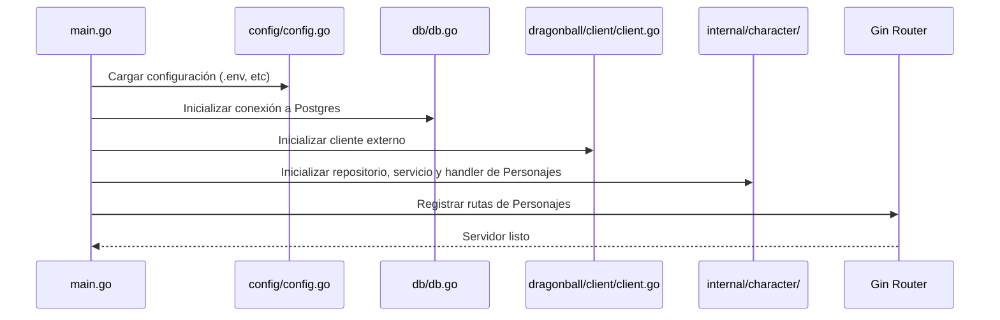
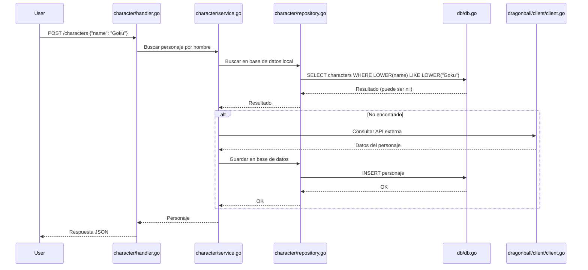

# Dragon Ball API

API REST en Golang para consultar y almacenar personajes de Dragon Ball.  
Utiliza una base de datos Postgres para almacenar la información de forma local. El proyecto utiliza las siguientes herramientas:

- **Gin**: Para servir las peticiones HTTP.
- **GORM**: Para interactuar con la base de datos.
- **Mockery**: Para generar mocks automáticos en los tests.

## Características

- Consulta de personajes por nombre (primero busca en la base de datos local, si no existe, consulta la [API externa](https://web.dragonball-api.com)).
- Almacena los personajes consultados en la base de datos local.
- Lista todos los personajes almacenados localmente (para verificar los datos).

## Estructura del Proyecto

Se siguió una estructura de proyecto basada en dominios. En este enfoque, la aplicación se divide en dominios delimitados, donde cada uno posee sus propias capas, incluyendo modelos, repositorios y servicios. De esta manera, se aísla la lógica y se mantiene el código específico de cada dominio agrupado, lo que permite una mejor organización y claridad.

## Endpoints

- `POST /characters` 

  Consulta un personaje por nombre.  

  **Body:**

  ```json
  { "name": "Goku" }
  ```

- `GET /characters`  

  Lista los personajes almacenados en la base de datos local (útil para verificar el proceso).

## Requisitos

- [Go 1.21+](https://go.dev/dl/)
- [Docker](https://www.docker.com/products/docker-desktop/)
- [Docker Compose](https://docs.docker.com/compose/install/)

## Uso

> Nota: El proyecto utiliza Make por comodidad, pero también se indican los comandos equivalentes con Docker Compose y Go.

### 1 - Ejecutar con Docker

```bash
# Iniciar la API (y la base de datos si no está corriendo)
make start
```

**Sin Make:**

```bash
docker-compose up api --build
```

### 2 - Ejecutar localmente (sin Docker)

Primero, iniciar la base de datos:

```bash
make start-deps
```

**Sin Make:**

```bash
docker-compose up -d postgres
```

Luego, ejecutar la API:

```bash
go run cmd/api/main.go
```

### 3 - Realizar una petición

Se pueden usar los siguientes comandos `curl`:

**Consultar un personaje**

```bash
curl -i -X POST http://localhost:8080/characters \
  -H "Content-Type: application/json" \
  -d '{"name": "Goku"}'
```

**Listar todos los personajes**

```bash
curl -i -X GET http://localhost:8080/characters
```

## Diagrama de Flujo


### 1. Inicio de la aplicación

Este diagrama representa el flujo de inicialización de la aplicación, desde la carga del entorno hasta el arranque del servidor con Gin.




### 2. Consulta de personaje (`POST /characters`)

Este diagrama muestra cómo se maneja una solicitud para consultar un personaje por nombre.  


